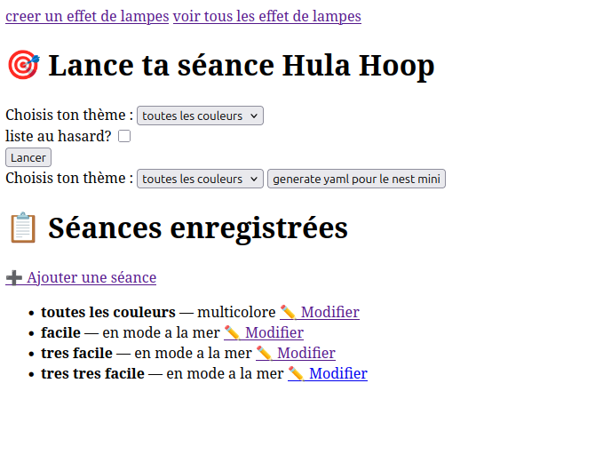
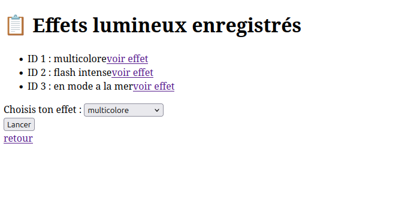
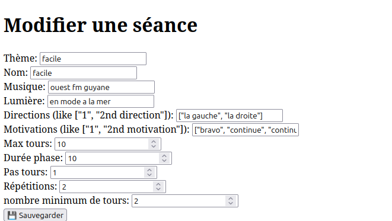

- execute python script pour faire gym en musique avec scenes assistant vocal
# assistant-vocal-led-music-gym
- python 3 app
- python3 -m http.server 8000
- autre : python3 app.py
- autre : python3 lumiere_ws_controller
- python3 dbseances

